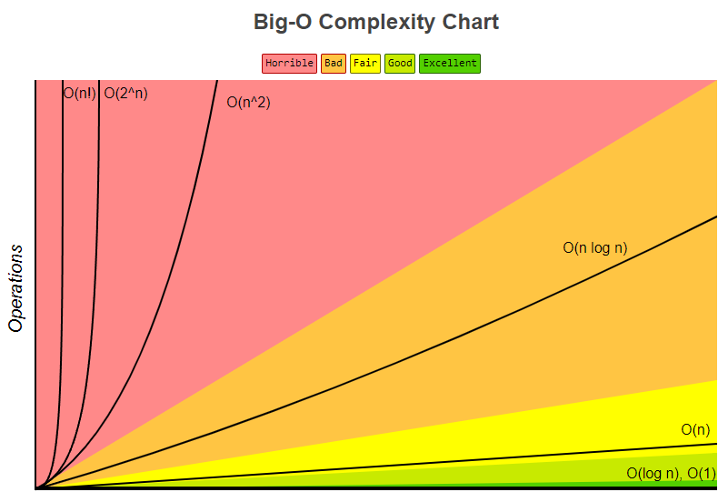

# Big O Notation

 

Secara sederhana, Big O Notation adalah suatu acuan untuk mengukur seberapa efisien performa algorithm yang dibuat. Big O Notation dapat diukur dari segi efisiensi waktu dan dari segi efisiensi memori. Coba lihat grafik dibawah ini deh.

_Sumber: [**Big O Cheat Sheet**](https://www.bigocheatsheet.com/)_

Kalau kalian gak ngerti gimana cara bacanya, tenang aja. Kalian dapat mengkategorikan menjadi beberapa kategori sebagai berikut:

1. Sangat Efisien (Hijau)
2. Cukup Efisien (Kuning)
3. Efisien (Oranye)
4. Sangat Tidak Efisien (Merah)

## Cara membaca Big O Notation

Jika kalian lihat notasi diatas seperti `O(log n)`, `O(1)`, cara bacanya yaitu **Big O of log n** dan **Big O of constant**. Atau lebih singkatnya **O of log n** dan **O of constant**. Mungkin ada yang bertanya-tanya, `n` itu apa sih? `n` adalah jumlah data yang akan diolah oleh algorithm tersebut. Jadi, semakin besar `n`, semakin besar pula waktu yang dibutuhkan oleh algorithm tersebut untuk menyelesaikan tugasnya.

Contoh, kamu diberikan tugas untuk menyusun buku di perpustakaan. Semisal kalian diberikan 100 buku, lalu susun buku tersebut berdasarkan jenis bukunya. Itu berarti `n`-nya adalah 100. Sudah paham ya? Kalau kalian belum paham silahkan tanyakan kepada rumput yang bergoyang. Hehehe canda ding 😅

Intinya `n` adalah jumlah data yang akan diolah. Performa algorithm bergantung pada jumlah data yang diolah. Semakin banyak data yang diolah, kecepatan dan memori yang diperlukan akan semakin meningkat dan juga sebaliknya.

## Cara mengukur Big O Notation

Penjelasan cara pengukuran Big O Notation sudah banyak dijelaskan di internet. Berikut ini adalah beberapa rekomendasi video YouTube mengenai penjelasan cara pengukuran Big O Notation.

1. [**Big O Notation - Pengenalan - Indonesia**](https://www.youtube.com/watch?v=JgtJ1oBaNz8)
2. [**Big-O notation in 5 minutes**](https://www.youtube.com/watch?v=__vX2sjlpXU)

Selamat belajar 😄

## Manfaat Big O Notation

Mempelajari Big O Notation dapat membawa manfaat seperti:

1. Mengetahui performa kecepatan dan efisiensi memori dari algorithm yang dibuat atau digunakan.
2. Memahami algorithm lebih baik.
3. Keuntungan karir seperti dapat menjawab pertanyaan technical interview.
4. Meningkatkan performa code Anda.
5. Meningkatkan kemampuan design algorithm.

Dan masih banyak manfaat lainnya yang dapat meningkatkan diri kamu sebagai programmer yang berkualitas.
