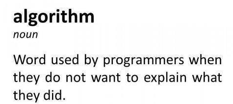

# Introduction to Algorithm

## Apa itu Algorithm?

Algorithm itu apa sih? Matematika kah? Bahasa gaul kah? Atau istilah cuma buat keren-kerenan aja? Pernahkah kalian habis menonton video di youtube tentang programming misalnya, nah nanti di feeds kalian itu muncul video rekomendasi lainnya yang berhubungan dengan programming juga.

> Algorithm adalah langkah-langkah atau cara untuk menyelesaikan sebuah masalah menggunakan cara yang sistematis atau terstruktur.

Contohnya pada kehidupan sehari-hari seperti memasak Indomie goreng.

1. Buka bungkus Indomie
2. Didihkan sekian miliLiter air
3. Tuang mie ke dalam panci
4. Masak selama 3 menit
5. Sambil menunggu mie matang, buka bumbunya dan tuang diatas piring
6. Jika sudah 3 menit, angkat dan tiriskan mienya
7. Tuang mie yang sudah ditiriskan ke piring yang sudah ada bumbu mienya
8. Aduk mienya sampai merata
9. Indomie siap disajikan

Nah itu adalah langkah-langkah untuk memasak Indomie. Alasan kita masak Indomie itu karena apa sih? Ya karena lapar. Jadi inti dari algorithm adalah untuk menyelesaikan sebuah masalah secara sistematis atau terstruktur. Dari contoh diatas, masalah yang dialami yaitu **lapar**. Algorithmnya adalah **memasak Indomie**. Langkah-langkahnya ya seperti yang diatas. Tetapi mungkin ada beberapa orang yang menambahkan seperti menambahkan sayuran, dan telur. Ada juga mungkin yang masaknya hanya 2 menit saja. Algorithm dapat menyelesaikan suatu masalah dengan langkah yang berbeda-beda.

Di dalam algorithm, kita mengenal istilah **Big O Notation**. Apa lagi itu Big O Notesyen?? 🙄
