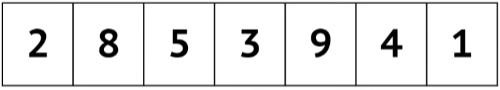
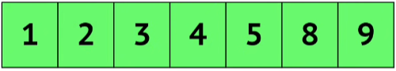

# Bubble Sort


Dinamakan **Bubble Sort** dikarenakan cara pengurutannya yang seperti gelembung yang berada di suatu kolam. Gelembung yang ringan akan mengambang naik ke posisi teratas dan gelembung yang lebih berat akan berada di posisi lebih bawah.

Sebelum mempelajarinya, cobalah menonton video YouTube berikut ini, [**Bubble sort in 2 minutes**](https://www.youtube.com/watch?v=xli_FI7CuzA).

## Penjelasan

Diberikan sebuah array yang berisikan sebuah angka seperti berikut,

### Input



### Output



Kunci dari bubble sort adalah membandingkan nilai mula yang satu dengan nilai yang bersebelahan. Jika nilai mula _lebih kecil_ dari nilai sebelahnya, maka tidak terjadi proses pertukaran/swapping. Jika nilai mula lebih _lebih besar_ dari nilai sebelahnya, maka proses pertukaran/swapping terjadi. Ulangi proses tersebut sampai seluruh elemen di dalam array terurut.

Jika dibuat menjadi sebuah narasi, maka kurang lebih seperti berikut ini:

1. Mulai dari awal array.
2. Bandingkan setiap pasangan elemen sebelahnya (elemen `i` dengan elemen `i+1`).
3. Jika elemen `i` lebih besar dari elemen sebelahnya (`i+1`), tukar posisi kedua elemen tersebut.
4. Ulangi proses dari langkah 2 sampai elemen terakhir.
5. Setelah satu iterasi, elemen terbesar akan berada di posisi terakhir. Ulangi proses dari langkah 2 untuk array yang lebih kecil, tanpa mengikutsertakan elemen terakhir.
6. Ulangi proses dari langkah 5 sampai array sudah terurut.

### Contoh

```
arr[] = {10, 80, 40, 30}
Indexes: 0   1   2   3

1. Index = 0, Number = 10
2. 10 < 80, jangan lakukan apapun dan teruskan

3. Index = 1, Number = 80
4. 80 > 40, swap 80 dan 40
5. Sekarang array-nya menjadi {10, 40, 80, 30}

6. Index = 2, Number = 80
7. 80 > 30, swap 80 dan 30
8. Sekarang array-nya menjadi {10, 40, 30, 80}

Ulangi langkah diatas kembali

arr[] = {10, 40, 30, 80}
Indexes: 0   1   2   3

1. Index = 0, Number = 10
2. 10 < 40, jangan lakukan apapun dan teruskan

3. Index = 1, Number = 40
4. 40 > 30, swap 40 dan 30
5. Sekarang array-nya menjadi {10, 30, 40, 80}

6. Index = 2, Number = 40
7. 40 < 80, do nothing
8. Sekarang array-nya menjadi {10, 30, 40, 80}

Ulangi langkah diatas kembali

arr[] = {10, 30, 40, 80}
Indexes: 0   1   2   3

1. Index = 0, Number = 10
2. 10 < 30, jangan lakukan apapun dan teruskan

3. Index = 1, Number = 30
4. 30 < 40, jangan lakukan apapun dan teruskan

5. Index = 2, Number = 40
6. 40 < 80, jangan lakukan apapun

Semenjak tidak ada lagi elemen yang dapat di swap, maka dari itu proses sorting dapat dihentikan.
```

## Source Code

import Tabs from "@theme/Tabs"
import TabItem from "@theme/TabItem"

<Tabs>
  <TabItem value="cpp" label="C++" default>

    #include <iostream>
    using namespace std;

    void bubbleSort(int arr[], int n) {
        int i, j;
        for (i = 0; i < n-1; i++) {
            for (j = 0; j < n-i-1; j++) {
                if (arr[j] > arr[j+1]) {
                    // Tukar array-nya
                    int temp = arr[j];
                    arr[j] = arr[j+1];
                    arr[j+1] = temp;
                }
            }
        }
    }

    int main() {
        int arr[] = {2, 8, 5, 3, 9, 4, 1};
        int n = sizeof(arr)/sizeof(arr[0]);
        bubbleSort(arr, n);
        cout << "Array setelah diurutkan: \n";
        for (int i=0; i < n; i++)
            cout << arr[i] << " ";
        return 0;
    }

  </TabItem>
  <TabItem value="python" label="Python" default>

    def bubbleSort(arr):
        n = len(arr)
        for i in range(n):
            for j in range(0, n-i-1):
                if arr[j] > arr[j+1]:
                    # Tukar array-nya
                    arr[j], arr[j+1] = arr[j+1], arr[j]
        return arr

    arr = [2, 8, 5, 3, 9, 4, 1]
    sorted_arr = bubbleSort(arr)
    print("Array setelah diurutkan:", sorted_arr)

  </TabItem>
  <TabItem value="java" label="Java" default>

    class BubbleSort {
        void bubbleSort(int arr[]) {
            int n = arr.length;
            for (int i = 0; i < n-1; i++)
                for (int j = 0; j < n-i-1; j++)
                    if (arr[j] > arr[j+1]) {
                        // Tukar array-nya
                        int temp = arr[j];
                        arr[j] = arr[j+1];
                        arr[j+1] = temp;
                    }
        }

        void printArray(int arr[]) {
            int n = arr.length;
            System.out.println("Array setelah diurutkan:");
            for (int i=0; i < n; ++i)
                System.out.print(arr[i] + " ");
            System.out.println();
        }

        public static void main(String args[]) {
            BubbleSort ob = new BubbleSort();
            int arr[] = {2, 8, 5, 3, 9, 4, 1};
            ob.bubbleSort(arr);
            ob.printArray(arr);
        }
    }

  </TabItem>
  <TabItem value="js" label="JavaScript" default>

    const bubbleSort = (arr) => {
        let n = arr.length;
        for (let i = 0; i < n - 1; i++) {
            for (let j = 0; j < n - i - 1; j++) {
                if (arr[j] > arr[j + 1]) {
                    // Tukar array-nya
                    let temp = arr[j];
                    arr[j] = arr[j + 1];
                    arr[j + 1] = temp;
                }
            }
        }
        return arr;
    }

    let arr = [2, 8, 5, 3, 9, 4, 1];
    let sortedArr = bubbleSort(arr);
    console.log("Sorted array:", sortedArr);

  </TabItem>
</Tabs>

## Sumber lain

Kalian bisa melihat sumber lainnya berikut ini,

1. [**Animation Explanation**](https://boardhub.github.io/tute/?wd=bubbleSortAlgo2)
