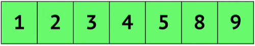

# Insertion Sort

Dinamakan **Insertion Sort** dikarenakan cara mengurutkan elemen dengan memasukkan setiap elemen ke posisi yang tepat dalam daftar yang terurut.

Sebelum mempelajarinya, cobalah menonton video YouTube berikut ini, [**Insertion sort in 2 minutes**](https://www.youtube.com/watch?v=JU767SDMDvA).

## Complexity

|  Case   | Time Complexity | Space Complexity |
| :-----: | :-------------: | ---------------- |
|  Best   |     $O(n)$      | $O(1)$           |
| Average |    $O(n^2)$     | $O(1)$           |
|  Worst  |    $O(n^2)$     | $O(1)$           |

## Penjelasan

Diberikan sebuah array yang berisikan sebuah angka seperti berikut,

### Input

### Output

