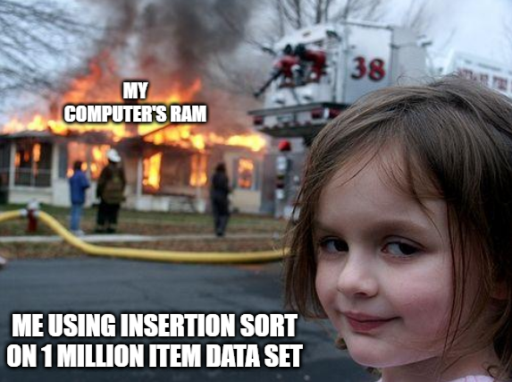

# Insertion Sort



Dinamakan **Insertion Sort** dikarenakan cara mengurutkan elemen dengan memasukkan setiap elemen ke posisi yang tepat dalam daftar yang terurut.

Sebelum mempelajarinya, cobalah menonton video YouTube berikut ini, [**Insertion sort in 2 minutes**](https://www.youtube.com/watch?v=JU767SDMDvA).

## Complexity

|  Case   | Time Complexity | Space Complexity |
| :-----: | :-------------: | ---------------- |
|  Best   |     $O(n)$      | $O(1)$           |
| Average |    $O(n^2)$     | $O(1)$           |
|  Worst  |    $O(n^2)$     | $O(1)$           |

## Penjelasan

Diberikan sebuah array yang berisikan sebuah angka seperti berikut,

### Input


### Output


Inti dari insertion sort adalah membandingkan element yang sedang ditunjuk dengan element sebelah kirinya.

Narasi dari insertion sort adalah sebagai berikut,

1. Tentukan elemen pertama sebagai suatu data yang terurut.
2. Kemudian lakukan loop untuk menelusuri seluruh data yang tersisa.
3. Tentukan elemen berikutnya dan bandingkan dengan elemen yang sudah terurut sebelumnya.
4. Jika elemen berikutnya lebih kecil dari elemen terurut sebelumnya, lakukan penukaran posisi elemen tersebut dengan elemen sebelumnya.
5. Teruskan proses penukaran posisi elemen hingga elemen berikutnya berada pada posisi yang tepat.
6. Ulangi proses loop hingga semua data terurut sesuai urutan yang ditentukan.

## Contoh

```
12, 11, 13, 5, 6

Mulai loop for i = 1 (element kedua yang di array) to 4 (jumlah dari input array)

i = 1.
Sejak 11 lebih kecil dari 12, pindahkan 12 dan insert 11 sebelum 12
11, 12, 13, 5, 6

i = 2.
13 akan berada di posisi yang sama karena semua element di subarray terurut lebih kecil dari 13
11, 12, 13, 5, 6

i = 3.
5 akan pindah ke posisi paling awal, dan semua element dari 11 ke 13 akan pindah satu posisi lebih depan dari posisi yang sekarang.
5, 11, 12, 13, 6

i = 4.
6 akan dipindahkan setelah 5, dan semua element dari 11 ke 13 akan pindah satu posisi lebih depan dari posisi yang sekarang.
5, 6, 11, 12, 13  -- sorted array
```

## Source Code

import Tabs from "@theme/Tabs"
import TabItem from "@theme/TabItem"

<Tabs>
  <TabItem value="cpp" label="C++" default>

    #include <iostream>
    using namespace std;

    void insertionSort(int arr[], int n) {
        int i, key, j;
        for (i = 1; i < n; i++) {
            key = arr[i];
            j = i - 1;

            while (j >= 0 && arr[j] > key) {
                arr[j + 1] = arr[j];
                j = j - 1;
            }
            arr[j + 1] = key;
        }
    }

    int main() {
        int arr[] = {12, 11, 13, 5, 6};
        int n = sizeof(arr) / sizeof(arr[0]);

        insertionSort(arr, n);

        for (int i = 0; i < n; i++)
            cout << arr[i] << " ";

        return 0;
    }

  </TabItem>
  <TabItem value="python" label="Python" default>

    def insertionSort(arr):
        for i in range(1, len(arr)):
            key = arr[i]
            j = i - 1
            while j >= 0 and key < arr[j]:
                arr[j + 1] = arr[j]
                j -= 1
            arr[j + 1] = key

    arr = [12, 11, 13, 5, 6]
    insertionSort(arr)
    print("Array setelah diurutkan:", arr)

  </TabItem>
  <TabItem value="java" label="Java" default>

    class InsertionSort {
        void sort(int arr[]) {
            int n = arr.length;
            for (int i = 1; i < n; ++i) {
                int key = arr[i];
                int j = i - 1;

                while (j >= 0 && arr[j] > key) {
                    arr[j + 1] = arr[j];
                    j = j - 1;
                }
                arr[j + 1] = key;
            }
        }

        static void printArray(int arr[]) {
            int n = arr.length;
            for (int i = 0; i < n; ++i)
            System.out.print(arr[i] + " ");

            System.out.println();
        }

        public static void main(String args[]) {
            int arr[] = { 12, 11, 13, 5, 6 };

            InsertionSort ob = new InsertionSort();
            ob.sort(arr);

            printArray(arr);
        }
    }

  </TabItem>
  <TabItem value="js" label="JavaScript" default>

    const insertionSort = (arr) => {
        for (let i = 1; i < arr.length; i++) {
            let key = arr[i];
            let j = i - 1;
            while (j >= 0 && arr[j] > key) {
                arr[j + 1] = arr[j];
                j--;
            }
            arr[j + 1] = key;
        }
        return arr;
    }

    console.log(insertionSort([12, 11, 13, 5, 6]));

  </TabItem>
</Tabs>
