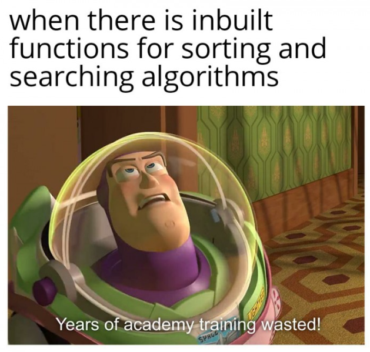

# Introduction to Sorting Algorithm

Pernahkah di kehidupan kalian melakukan pengurutan atau sorting? Misalnya kalian ingin mengurutkan buku-buku kalian, kalian akan mengurutkannya berdasarkan judul buku, tahun terbit, bahasa, dan lain-lain. Nah, sorting adalah proses pengurutan data berdasarkan kriteria tertentu.

Sorting algorithm memiliki beberapa jenis, yaitu:

1. [**Bubble Sort**](./bubble-sort)
2. [**Insertion Sort**](./insertion-sort)
3. [**Selection Sort**](./selection-sort)
4. [**Quick Sort**](./quick-sort)
5. [**Merge Sort**](./merge-sort)
6. [**Heap Sort**](./heap-sort)

Dan masih banyak lagi seperti counting sort, radix sort, shell sort dan sorting algorithm lainnya.
