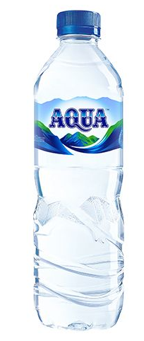

# Comment

Botol diatas menggunakan label "Aqua" sebagai merk dari botol tersebut.

Comment digunakan untuk memberikan penjelasan atau catatan tentang kode, dan dapat membantu membuat kode lebih mudah dibaca dan dimengerti oleh orang lain yang mungkin membacanya atau merawatnya.

> Comment adalah sebuah teks dalam sebuah program yang tidak akan dieksekusi oleh compiler/interpreter.

Umumnya comment diawali dengan tanda `//`. Beberapa bahasa programming lainnya menggunakan tanda `#` atau tanda `{}`
