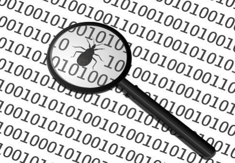

# Debugging

> Debugging adalah proses mencari dan memperbaiki kesalahan atau bug dalam kode.

Proses ini dilakukan untuk menemukan dan mengoreksi masalah yang mungkin muncul selama pengembangan software. Debugging dapat dilakukan dengan menggunakan alat bantu seperti debugger, atau dengan menambahkan pesan log pada kode untuk mengetahui perjalanan eksekusi program.

Terdapat beberapa metode yang digunakan dalam debugging:

1. Menambahkan print statement untuk menampilkan nilai variabel dan mengecek aliran logika dari program.
2. Menggunakan alat pembuat debug seperti breakpoint, watch variable, dan step-by-step execution
3. Menggunakan log monitoring
4. Memperbaiki dari kesalahan yang diketahui dengan menggunakan dokumentasi dan referensi API.

Debugging merupakan bagian penting dari proses pengembangan software yang memungkinkan untuk menyelesaikan masalah yang mungkin terjadi dan memastikan bahwa program berjalan sesuai dengan yang diharapkan.

Modern software IDE sudah memiliki fitur integrasi dengan debugger untuk memudahkan proses debugging.
