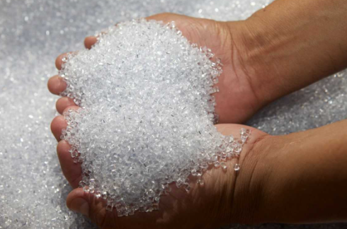

# Modules/Libraries

Gambar diatas adalah bijih plastik yang umumnya akan digunakan untuk pembuatan botol plastik. Botol plastik yang digunakan sehari-hari melalui beberapa tahapan mulai dari bahan mentah sampai ke produk jadi. Bayangkan jika kamu ingin memulai sebuah usaha minuman. Apakah kamu akan membuat botol/kemasannya dari awal? Mungkin tidak karena itu akan memakan biaya yang besar. Kamu harus membeli semua alat-alatnya hanya untuk membuat botol minum.

Kamu pasti akan membeli kemasannya dari sebuah produsen botol plastik dan kamu cukup menggunakan botol plastik yang sudah jadi tersebut. Nah, begitulah modules atau libraries di programming.

> Modules/Libraries adalah sekumpulan kode yang telah ditulis sebelumnya yang dapat digunakan untuk melakukan set fungsi atau tugas tertentu.
